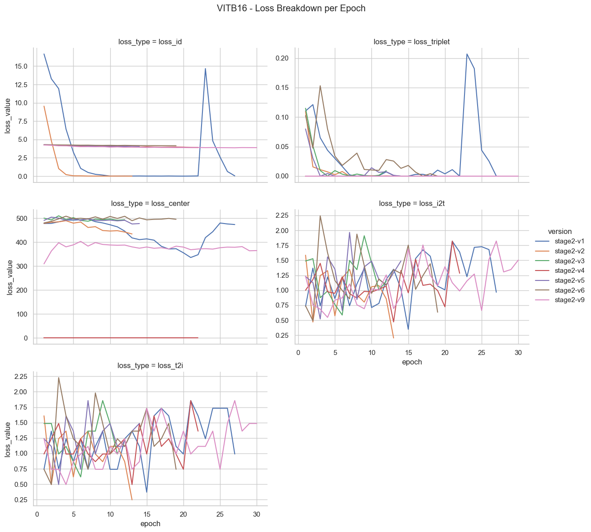
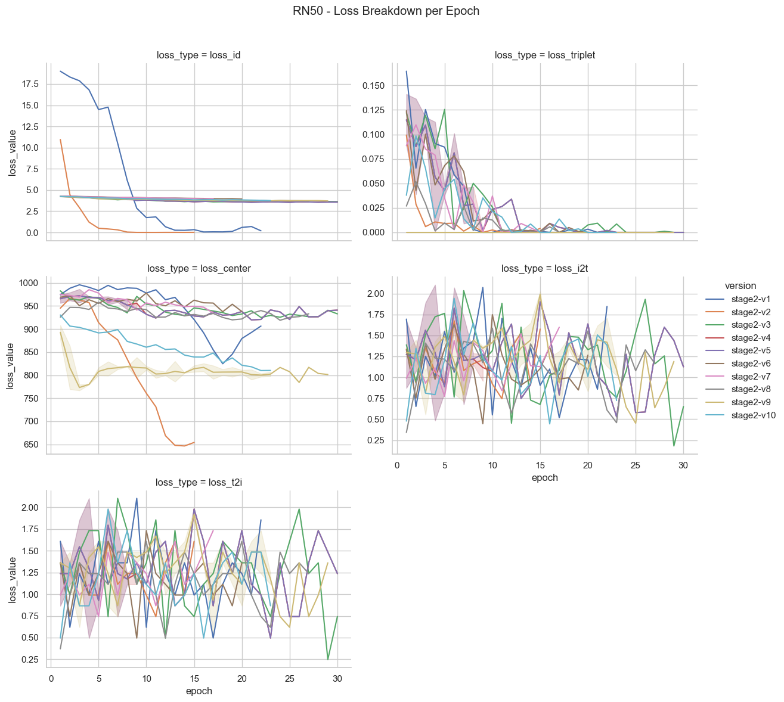
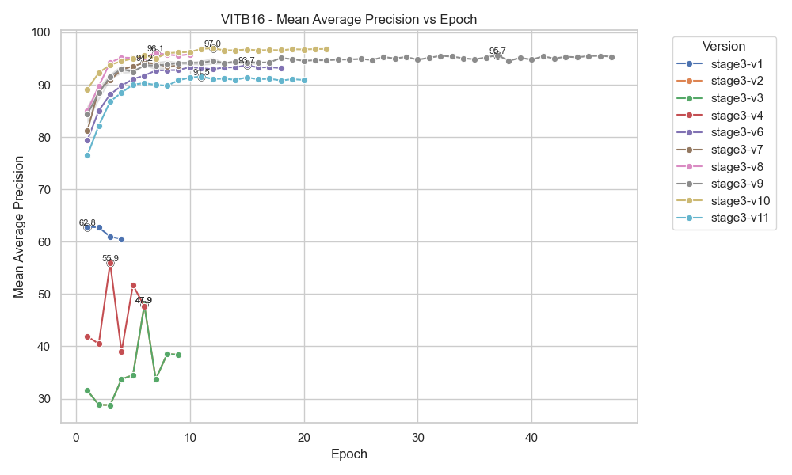

# 📁 Result Logs — CLIP-FH Evaluation & Visualization

This directory contains all logs, tables, plots, and dataset summaries generated throughout the CLIP-FH pipeline. These outputs are produced from **Stage 2 (CLIP-ReID)** and **Stage 3 (PromptSG)** experiments for both **ViT-B/16** and **RN50** backbones.

---

## 📊 Directory Contents

### 📁 Dataset Summary Files

| File                             | Description |
|----------------------------------|-------------|
| `dataset_11k_summary.txt`        | Text summary of the 11k Hands dataset composition. |
| `dataset_hd_summary.txt`         | Summary statistics for the HD Hands dataset. |
| `dataset_class_imbalance_check.txt` | Overview of class distribution imbalance. |

---

### 🧱 Code Structure

| File                 | Description |
|----------------------|-------------|
| `code_structure.txt` | Auto-generated tree of the entire codebase folder hierarchy. Useful for reproducibility and navigation. |

Generated using:  
```bash
python experiments/conclusion_outputs/generate_tree.py
````

---

## 📈 Stage 2: CLIP-ReID Logs & Visualizations

### ✅ Evaluation Tables

* `stage2_vitb16_eval_table.csv`
* `stage2_rn50_eval_table.csv`

These CSVs include split-wise and final average Rank-1, Rank-5, Rank-10, and mAP metrics.

### 📉 Training Metrics Tables

* `stage2_vitb16_train_table.csv`
* `stage2_rn50_train_table.csv`

Contain loss values and validation scores per epoch for each experiment version (v1–v10).

### 📊 Plots (ViT-B/16)





### 📊 Plots (RN50)





---

## 🎯 Stage 3: PromptSG Logs & Visualizations

### ✅ Evaluation Tables

* `stage3_vitb16_eval_table.csv`
* `stage3_rn50_eval_table.csv`

Log Rank-1, Rank-5, Rank-10, and mAP across 10 splits and final averages for each version (v1–v11).

### 📉 Training Tables

* `stage3_vitb16_train_table.csv`
* `stage3_rn50_train_table.csv`

Include per-epoch losses and validation metrics across all PromptSG versions.

### 📊 Plots (ViT-B/16)




### 📊 Plots (RN50)


---

## 📄 Final Result Summary

* `total_formatted_result_with_remarks.xlsx`:
  This Excel file summarizes all Stage 2 and Stage 3 results (both backbones), annotated with performance insights and final selections.

---

## 🔄 How These Files Were Generated

These files are outputs of the following scripts from `experiments/conclusion_outputs/`:

```bash
python generate_tree.py
python stage2_train_log_analysis.py
python stage2_eval_log_analysis.py
python plot_stage2_train_metrics.py

python stage3_train_log_analysis.py
python stage3_eval_log_analysis.py
python plot_stage3_train_metrics.py
```

---

## 🧠 Notes

* All plots are saved as `.png` and designed for presentation-ready clarity.
* CSVs can be opened in Excel or directly used for plotting and reporting.
* This folder acts as the **final deliverable folder** for analysis.

---

## 📬 Contact

For any questions regarding these results or how they were generated, please contact [babupallam@gmail.com](mailto:babupallam@gmail.com).

```